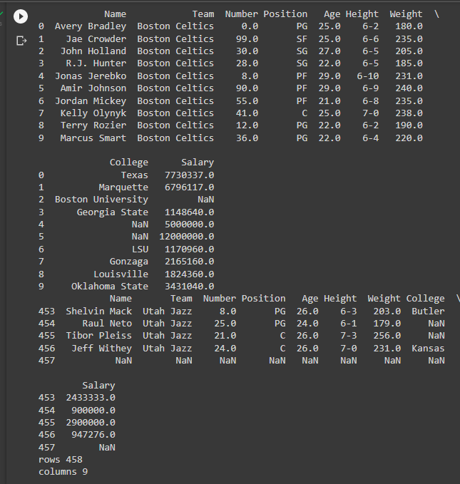

#READ FROM CSV
## AIM:
To write a python program for reading content from a CSV file.

## ALGORITHM:
Step 1:Import pandas as pd.

Step 2:Read the CSV file using read_csv method.

Step 3:Use head and tail method to get the required contents from the file.

Step 4:Use len() method to get the number of rows and columns

Step 5:Print the output.

## PROGRAM:
```
import csv
with open('employee_file.csv',mode='w') as employee_file:
  employee_writer = csv.writer(employee_file,delimiter=',',quotechar='"',quoting=csv.QUOTE_MINIMAL)
  employee_writer.writerow(['John Smith','Accounting','November'])
  employee_writer.writerow(['Erica Meyers','IT','March'])

  ```

## OUTPUT:


## RESULT:
Thus a python program is written to read the contents of a CSV file.